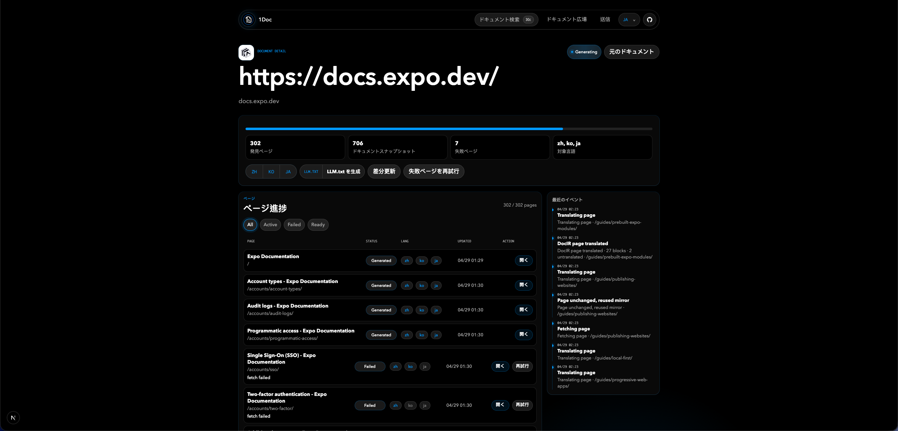

# 1Doc

**世界のドキュメントを、あなたの言葉で。**

1Doc は、公開ドキュメントサイトを多言語の静的ミラーに変換するオープンソースプロジェクトです。生成済みのページは保存されるため、再訪問時に毎回翻訳モデルを呼び出す必要はありません。

## 言語版

- [English](./README.md)
- [简体中文](./README.zh-CN.md)
- [日本語](./README.ja.md)
- [한국어](./README.ko.md)

## スクリーンショット



## 主な機能

- ドキュメント広場: すでに翻訳されたドキュメントを検索、閲覧。
- 新規タスク送信: 公開ドキュメント URL と対象言語を指定。
- 重複防止: 同じサイトのタスクが実行中または完了済みなら既存プロジェクトを再利用。
- プロジェクト単位の生成: ページ発見、HTML 取得、翻訳、静的ミラー公開。
- 静的な閲覧体験: 生成済みページは保存済み HTML から返される。
- 翻訳キャッシュ: 同じテキストセグメントを再利用。
- ページ進捗: 発見済み、生成済み、失敗ページを確認し、再試行可能。
- LLM.txt: 生成済みドキュメントから `LLM.txt` を作成、コピー。
- UI i18n: 中国語、英語、日本語、韓国語、フランス語、ドイツ語、スペイン語、ポルトガル語に対応。

## 仕組み

1. ユーザーが公開ドキュメント URL と対象言語を送信します。
2. 1Doc は `doc_sites` プロジェクトを作成または再利用します。
3. sitemap と同一ホスト内リンクからページを発見します。
4. 各ページの HTML を取得し、翻訳し、実行時スクリプトを削除して静的 HTML として保存します。
5. ユーザーは `/sites/{siteSlug}/{lang}/...` でミラーを閲覧します。
6. 生成後、ページ一覧から `LLM.txt` を作成できます。

## 技術スタック

- Next.js App Router
- React 19
- Supabase REST API
- Volcengine Ark Chat Completions API
- 任意: Volcengine TranslateText フォールバック
- 任意: Inngest バックグラウンドジョブ
- 任意: Browserless レンダリングフォールバック
- `parse5` による HTML 変換

## 必要なもの

- Node.js 20+
- Supabase プロジェクト
- Volcengine Ark API key とモデル名または endpoint ID
- 任意: 本番向けの Inngest key
- 任意: JavaScript が多いドキュメント向け Browserless WebSocket URL

## クイックスタート

```bash
npm install
cp .env.example .env.local
npm run dev
```

`http://localhost:3000` を開きます。

## 環境変数

詳しくは [.env.example](./.env.example) を参照してください。

```bash
ARK_API_KEY=
ARK_MODEL=doubao-seed-1-6-flash-250615
ARK_BASE_URL=https://ark.cn-beijing.volces.com/api/v3
ARK_TIMEOUT_MS=60000

SUPABASE_URL=
SUPABASE_SERVICE_ROLE_KEY=

INNGEST_EVENT_KEY=
INNGEST_SIGNING_KEY=
INNGEST_DEV=

SITE_BASE_URL=http://localhost:3000
MIRROR_PAGE_CONCURRENCY=8
BROWSERLESS_WS_URL=
TRANSLATE_API_TOKEN=
```

## Supabase セットアップ

Supabase SQL Editor で [supabase/schema.sql](./supabase/schema.sql) を実行してください。

主要テーブル:

- `doc_sites`: ドキュメントサイトプロジェクト。
- `source_pages`: 発見された元ページ。
- `mirrored_pages`: 生成済み翻訳 HTML。
- `translation_segments`: 翻訳キャッシュ。
- `generation_jobs` / `generation_locks`: ジョブ進捗と重複防止。
- `job_events`: イベントログ。
- `site_votes`: 公開ランキング用の投票。
- `site_llm_texts`: 生成済み `LLM.txt`。

## 開発

```bash
npm run dev
npm run typecheck
npm run build
```

## デプロイ

推奨デプロイ先は Vercel です。

1. Supabase プロジェクトを作成し、`supabase/schema.sql` を実行します。
2. Vercel に環境変数を設定します。
3. `SITE_BASE_URL` を本番 URL にします。
4. 公開運用では Inngest などの永続的なジョブ基盤を推奨します。
5. Next.js アプリをデプロイします。

## 制限

- 公開されている、ログイン不要のドキュメントサイトのみ対応。
- 認証が必要なドキュメントは未対応。
- JavaScript が多いサイトでは Browserless が必要な場合があります。
- 初期版は静的な読書体験を優先し、元サイトの JS 互換性は保証しません。

## スポンサー

1Doc が役に立った場合は、Afdian から開発を支援できます: [1Doc を支援する](https://ifdian.net/a/itool/plan)。

## 貢献

Issue と pull request を歓迎します。改善候補:

- より強力なページ発見。
- 用語一貫性と翻訳品質。
- 追加のストレージバックエンド。
- 追加のキュー/worker アダプター。
- UI 翻訳の拡充。

## License

MIT。詳細は [LICENSE](./LICENSE) を参照してください。
