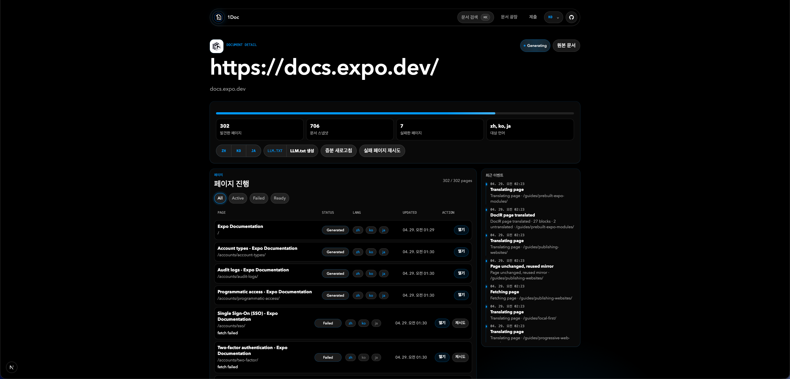

# 1Doc

**세계의 문서를 당신의 언어로.**

1Doc은 공개 문서 사이트를 다국어 정적 미러로 변환하는 오픈소스 프로젝트입니다. 한 번 생성된 페이지는 저장되므로, 다시 방문할 때마다 번역 모델을 호출하지 않습니다.

## 언어 버전

- [English](./README.md)
- [简体中文](./README.zh-CN.md)
- [日本語](./README.ja.md)
- [한국어](./README.ko.md)

## 스크린샷



## 주요 기능

- 문서 광장: 이미 번역된 공개 문서를 검색하고 바로 읽기.
- 새 문서 제출: 공개 문서 URL과 대상 언어를 선택.
- 중복 방지: 같은 사이트가 이미 생성 중이거나 완료된 경우 기존 프로젝트로 이동.
- 프로젝트 단위 생성: 페이지 발견, HTML 가져오기, 번역, 정적 미러 게시.
- 정적 읽기 경험: 생성된 페이지는 저장된 HTML에서 제공.
- 번역 캐시: 반복되는 텍스트 세그먼트를 재사용.
- 페이지 진행 상황: 발견, 생성, 실패 페이지를 확인하고 재시도.
- LLM.txt: 생성된 문서 사이트의 `LLM.txt` 인덱스를 생성하고 복사.
- 자체 UI i18n: 중국어, 영어, 일본어, 한국어, 프랑스어, 독일어, 스페인어, 포르투갈어 지원.

## 동작 방식

1. 사용자가 공개 문서 URL과 대상 언어를 제출합니다.
2. 1Doc은 `doc_sites` 프로젝트를 만들거나 기존 프로젝트를 재사용합니다.
3. sitemap과 같은 호스트 내부 링크에서 페이지를 발견합니다.
4. 각 페이지의 HTML을 가져오고, 번역하고, 런타임 스크립트를 제거한 뒤 정적 HTML로 저장합니다.
5. 사용자는 `/sites/{siteSlug}/{lang}/...` 경로에서 미러 문서를 읽습니다.
6. 생성 후, 저장된 페이지 목록에서 `LLM.txt`를 만들 수 있습니다.

## 기술 스택

- Next.js App Router
- React 19
- Supabase REST API
- Volcengine Ark Chat Completions API
- 선택: Volcengine TranslateText fallback
- 선택: Inngest 백그라운드 작업
- 선택: Browserless 렌더링 fallback
- `parse5` 기반 HTML 변환

## 요구 사항

- Node.js 20+
- Supabase 프로젝트
- Volcengine Ark API key와 모델명 또는 endpoint ID
- 선택: 운영 환경용 Inngest key
- 선택: JavaScript가 많은 문서 사이트용 Browserless WebSocket URL

## 빠른 시작

```bash
npm install
cp .env.example .env.local
npm run dev
```

`http://localhost:3000`을 엽니다.

## 환경 변수

자세한 내용은 [.env.example](./.env.example)을 확인하세요.

```bash
ARK_API_KEY=
ARK_MODEL=doubao-seed-1-6-flash-250615
ARK_BASE_URL=https://ark.cn-beijing.volces.com/api/v3
ARK_TIMEOUT_MS=60000

SUPABASE_URL=
SUPABASE_SERVICE_ROLE_KEY=

INNGEST_EVENT_KEY=
INNGEST_SIGNING_KEY=
INNGEST_DEV=

SITE_BASE_URL=http://localhost:3000
MIRROR_PAGE_CONCURRENCY=8
BROWSERLESS_WS_URL=
TRANSLATE_API_TOKEN=
```

## Supabase 설정

Supabase SQL Editor에서 [supabase/schema.sql](./supabase/schema.sql)을 실행하세요.

주요 테이블:

- `doc_sites`: 문서 사이트 프로젝트.
- `source_pages`: 발견된 원본 페이지.
- `mirrored_pages`: 생성된 번역 HTML.
- `translation_segments`: 번역 캐시.
- `generation_jobs` / `generation_locks`: 작업 진행과 중복 방지.
- `job_events`: 이벤트 로그.
- `site_votes`: 공개 정렬용 투표.
- `site_llm_texts`: 생성된 `LLM.txt`.

## 개발

```bash
npm run dev
npm run typecheck
npm run build
```

## 배포

권장 배포 대상은 Vercel입니다.

1. Supabase 프로젝트를 만들고 `supabase/schema.sql`을 실행합니다.
2. Vercel에 환경 변수를 설정합니다.
3. `SITE_BASE_URL`을 운영 URL로 설정합니다.
4. 공개 운영에는 Inngest 같은 지속 가능한 작업 시스템을 권장합니다.
5. Next.js 앱을 배포합니다.

## 제한 사항

- 공개되어 있고 로그인이 필요 없는 문서 사이트만 지원합니다.
- 인증이 필요한 문서는 지원하지 않습니다.
- JavaScript가 많은 사이트는 Browserless가 필요할 수 있습니다.
- 초기 버전은 정적 읽기 품질을 우선하며, 원본 사이트의 모든 JS 상호작용을 보장하지 않습니다.

## 후원

1Doc이 도움이 되었다면 Afdian에서 개발을 후원할 수 있습니다: [1Doc 후원하기](https://ifdian.net/a/itool/plan).

## 기여

Issue와 pull request를 환영합니다. 개선하기 좋은 영역:

- 더 강력한 문서 페이지 발견.
- 용어 일관성과 번역 품질.
- 추가 스토리지 백엔드.
- 추가 큐/worker 어댑터.
- UI 번역 확장.

## License

MIT. 자세한 내용은 [LICENSE](./LICENSE)를 확인하세요.
