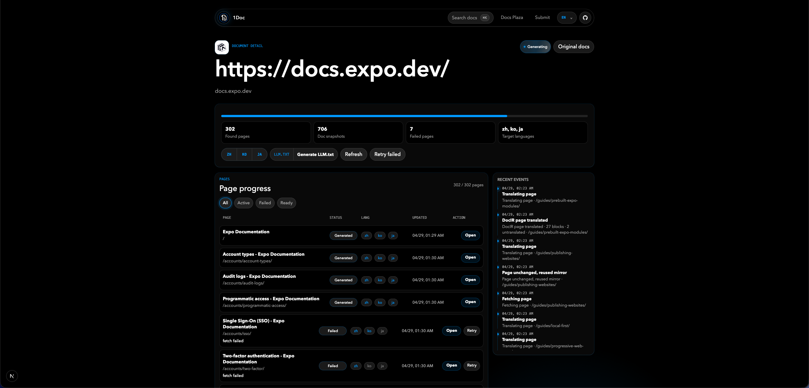

# 1Doc

**Docs in the language you think in.**

1Doc is an open-source multilingual documentation mirror. It turns public documentation sites into fast, static, translated mirrors that can be searched, shared, revisited, and reused without translating the same pages again.

## Translations

- [English](./README.md)
- [简体中文](./README.zh-CN.md)
- [日本語](./README.ja.md)
- [한국어](./README.ko.md)

## Screenshot



## What It Does

- Public docs plaza: browse translated documentation that is already available.
- Submit new docs: add a public documentation URL and target languages.
- Duplicate-safe jobs: if the same site is already running or ready, 1Doc routes users to the existing project.
- Project-level generation: discover pages, fetch HTML, translate content, and publish static mirrored pages.
- Static reading experience: generated pages are served from storage and do not call the translation model on each visit.
- Translation cache: repeated text segments are reused across pages and refreshes.
- Page progress: inspect discovered, generated, failed, and retryable pages.
- LLM.txt export: generate and copy an `LLM.txt` index for every translated documentation site.
- Built-in i18n: the 1Doc UI supports Chinese, English, Japanese, Korean, French, German, Spanish, and Portuguese.

## How It Works

1. A user submits a public docs URL and one or more target languages.
2. 1Doc creates or reuses a `doc_sites` project.
3. The generator discovers pages from sitemaps and same-host links.
4. Each page is fetched, translated, stripped of runtime scripts, and saved as static HTML.
5. Users browse mirrored pages at `/sites/{siteSlug}/{lang}/...`.
6. After generation, 1Doc can produce an `LLM.txt` file from the generated pages.

## Tech Stack

- Next.js App Router
- React 19
- Supabase REST API for persistence
- Volcengine Ark Chat Completions API for translation
- Optional Volcengine TranslateText fallback
- Optional Inngest background jobs
- Optional Browserless rendering fallback for SPA-like docs
- `parse5` for DOM-safe HTML transformation

## Requirements

- Node.js 20+
- A Supabase project
- A Volcengine Ark API key and model or endpoint ID
- Optional: Inngest keys for production-grade background jobs
- Optional: Browserless WebSocket URL for JavaScript-heavy documentation sites

## Quick Start

```bash
npm install
cp .env.example .env.local
npm run dev
```

Open `http://localhost:3000`.

## Environment Variables

See [.env.example](./.env.example).

```bash
ARK_API_KEY=
ARK_MODEL=doubao-seed-1-6-flash-250615
ARK_BASE_URL=https://ark.cn-beijing.volces.com/api/v3
ARK_TIMEOUT_MS=60000

SUPABASE_URL=
SUPABASE_SERVICE_ROLE_KEY=

INNGEST_EVENT_KEY=
INNGEST_SIGNING_KEY=
INNGEST_DEV=

SITE_BASE_URL=http://localhost:3000
MIRROR_PAGE_CONCURRENCY=8
MIRROR_LANG_CONCURRENCY=2
MIRROR_RENDERED_DISCOVERY_LIMIT=50
MIRROR_EXPANDED_DISCOVERY_LIMIT=20
TRANSLATE_BATCH_CONCURRENCY=2
TRANSLATE_BATCH_ITEMS=12
TRANSLATE_BATCH_CHARS=3000
BROWSERLESS_WS_URL=
TRANSLATE_API_TOKEN=
```

Notes:

- `ARK_MODEL` can be a model name or an Ark endpoint ID such as `ep-...`.
- `MIRROR_PAGE_CONCURRENCY` defaults to `8` and is capped at `16`.
- `MIRROR_LANG_CONCURRENCY` controls per-page target-language parallelism and defaults to `2`.
- `MIRROR_RENDERED_DISCOVERY_LIMIT` caps how many pages use browser-rendered link discovery per site.
- `MIRROR_EXPANDED_DISCOVERY_LIMIT` caps how many pages use browser-rendered discovery after safe UI expansion per site.
- `TRANSLATE_BATCH_CONCURRENCY` controls parallel model batches and defaults to `2`.
- `BROWSERLESS_WS_URL` is optional. When configured, 1Doc can use rendered and expanded discovery for JavaScript-heavy pages.
- `SUPABASE_SERVICE_ROLE_KEY` must only be used on the server. Do not expose it to browser code.

## Supabase Setup

Run [supabase/schema.sql](./supabase/schema.sql) in the Supabase SQL editor.

The schema includes:

- `doc_sites`: mirror projects and language configuration.
- `source_pages`: discovered source pages and fetch status.
- `mirrored_pages`: generated translated HTML.
- `translation_segments`: reusable text segment cache.
- `generation_jobs` and `generation_locks`: job progress and duplicate prevention.
- `job_events`: timeline and debug events.
- `site_votes`: public ranking votes.
- `site_llm_texts`: generated `LLM.txt` artifacts.

## Development

```bash
npm run dev
npm run typecheck
npm run build
```

## Deployment

The intended deployment target is Vercel.

1. Create a Supabase project and run `supabase/schema.sql`.
2. Configure the environment variables in Vercel.
3. Set `SITE_BASE_URL` to your production URL.
4. Configure Inngest if you want durable background jobs.
5. Deploy the Next.js app.

Without Inngest, local development can still run generation inline. For real public usage, Inngest or another durable worker system is recommended.

## Current Limitations

- Only public documentation sites are supported.
- Authenticated docs are not supported.
- JavaScript-heavy docs may need Browserless.
- The first version prioritizes static reading quality over preserving original JavaScript interactions.
- Discovery is scoped to the submitted hostname and path where appropriate.

## Project Structure

```text
app/                 Next.js routes and UI
app/api/sites/       Site creation, progress, votes, refresh, LLM.txt APIs
lib/mirror/          Discovery, generation, storage, jobs, URL handling
lib/docir/           Document-oriented extraction and translation helpers
supabase/schema.sql  Database schema
public/              Static assets
```

## Sponsor

If 1Doc helps you, you can support continued development on Afdian: [Sponsor 1Doc](https://ifdian.net/a/itool/plan).

## Contributing

Issues and pull requests are welcome. Useful areas to improve:

- More robust documentation discovery.
- Better language quality and terminology memory.
- More storage backends.
- Better queue/worker adapters.
- More complete UI translations.
- Import/export formats for AI tooling.

See [CONTRIBUTING.md](./CONTRIBUTING.md) before opening a pull request.

## Security

Please report vulnerabilities privately. See [SECURITY.md](./SECURITY.md).

## License

MIT. See [LICENSE](./LICENSE).
