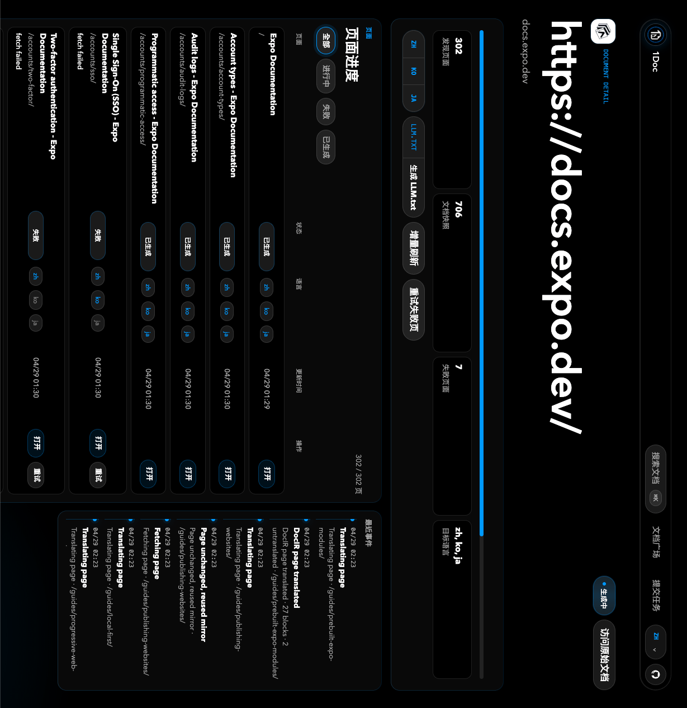

# 1Doc

**让世界的文档，说你的语言。**

1Doc 是一个开源的多语言文档镜像站。它可以把公开文档站转换成快速、静态、可复用的翻译镜像。生成完成后，用户再次访问时直接读取已经生成好的页面，不需要每次重新调用翻译模型。

## 语言版本

- [English](./README.md)
- [简体中文](./README.zh-CN.md)
- [日本語](./README.ja.md)
- [한국어](./README.ko.md)

## 截图



## 功能

- 文档广场：浏览已经翻译好的公开文档。
- 提交新文档：输入公开文档站 URL，选择目标语言。
- 防重复任务：同一个站点已经在生成或已经完成时，直接进入已有项目。
- 项目级生成：发现页面、抓取 HTML、翻译内容、发布静态镜像。
- 静态阅读体验：镜像页直接从存储读取，不在访问时实时翻译。
- 翻译缓存：相同文本片段可跨页面、跨刷新复用。
- 页面进度：查看发现、生成、失败页面，并支持重试。
- LLM.txt：为已生成的文档站生成并复制 `LLM.txt` 索引。
- 1Doc 自身 i18n：支持中文、英文、日文、韩文、法文、德文、西班牙文、葡萄牙文。

## 工作流程

1. 用户提交公开文档 URL 和目标语言。
2. 1Doc 创建或复用一个 `doc_sites` 项目。
3. 后台从 sitemap 和站内链接发现页面。
4. 每个页面会被抓取、翻译、移除原站运行时脚本，并保存为静态 HTML。
5. 用户通过 `/sites/{siteSlug}/{lang}/...` 访问镜像页面。
6. 生成完成后，可以基于已生成页面产出 `LLM.txt`。

## 技术栈

- Next.js App Router
- React 19
- Supabase REST API
- 火山方舟 Chat Completions API
- 可选火山 TranslateText 兜底
- 可选 Inngest 后台任务
- 可选 Browserless 渲染兜底
- `parse5` 做 DOM 安全 HTML 转换

## 环境要求

- Node.js 20+
- Supabase 项目
- 火山方舟 API Key 和模型名或 endpoint ID
- 可选：Inngest key，用于生产级后台任务
- 可选：Browserless WebSocket URL，用于偏 SPA 的文档站

## 快速开始

```bash
npm install
cp .env.example .env.local
npm run dev
```

打开 `http://localhost:3000`。

## 环境变量

参考 [.env.example](./.env.example)。

```bash
ARK_API_KEY=
ARK_MODEL=doubao-seed-1-6-flash-250615
ARK_BASE_URL=https://ark.cn-beijing.volces.com/api/v3
ARK_TIMEOUT_MS=60000

SUPABASE_URL=
SUPABASE_SERVICE_ROLE_KEY=

INNGEST_EVENT_KEY=
INNGEST_SIGNING_KEY=
INNGEST_DEV=

SITE_BASE_URL=http://localhost:3000
MIRROR_PAGE_CONCURRENCY=8
MIRROR_LANG_CONCURRENCY=2
MIRROR_RENDERED_DISCOVERY_LIMIT=50
MIRROR_EXPANDED_DISCOVERY_LIMIT=20
TRANSLATE_BATCH_CONCURRENCY=2
TRANSLATE_BATCH_ITEMS=12
TRANSLATE_BATCH_CHARS=3000
BROWSERLESS_WS_URL=
TRANSLATE_API_TOKEN=
```

说明：

- `ARK_MODEL` 可以是模型名，也可以是方舟 endpoint ID，例如 `ep-...`。
- `MIRROR_PAGE_CONCURRENCY` 默认是 `8`，最大限制为 `16`。
- `MIRROR_LANG_CONCURRENCY` 控制单页多目标语言并发，默认是 `2`。
- `MIRROR_RENDERED_DISCOVERY_LIMIT` 控制每个站点最多多少页面启用浏览器渲染链接发现。
- `MIRROR_EXPANDED_DISCOVERY_LIMIT` 控制每个站点最多多少页面启用安全展开后的浏览器发现。
- `TRANSLATE_BATCH_CONCURRENCY` 控制模型翻译批次并发，默认是 `2`。
- `BROWSERLESS_WS_URL` 可选，配置后可为 JavaScript 较重的页面启用渲染发现和展开发现。
- `SUPABASE_SERVICE_ROLE_KEY` 只能用于服务端，不能暴露到浏览器。

## Supabase 配置

在 Supabase SQL Editor 里执行 [supabase/schema.sql](./supabase/schema.sql)。

主要表：

- `doc_sites`：文档站项目和语言配置。
- `source_pages`：发现到的原始页面和抓取状态。
- `mirrored_pages`：生成后的翻译 HTML。
- `translation_segments`：文本片段翻译缓存。
- `generation_jobs` / `generation_locks`：任务进度和防重复锁。
- `job_events`：任务事件和调试日志。
- `site_votes`：公开排序投票。
- `site_llm_texts`：生成的 `LLM.txt` 内容。

## 开发命令

```bash
npm run dev
npm run typecheck
npm run build
```

## 部署

推荐部署到 Vercel。

1. 创建 Supabase 项目并执行 `supabase/schema.sql`。
2. 在 Vercel 配置环境变量。
3. 把 `SITE_BASE_URL` 设置成生产域名。
4. 生产公开使用建议配置 Inngest。
5. 部署 Next.js 应用。

本地开发时即使不配置 Inngest，也可以用 inline generation 跑通流程。正式公开使用时，建议接入 Inngest 或其他可靠的后台任务系统。

## 当前限制

- 只支持公开、无需登录的文档站。
- 不支持需要鉴权的文档。
- JavaScript 很重的文档站可能需要 Browserless。
- 首版优先保证静态阅读质量，不追求保留原站所有 JS 交互。
- 页面发现会限制在提交的 hostname 和合适的 path 范围内。

## 项目结构

```text
app/                 Next.js 路由和 UI
app/api/sites/       文档项目、进度、投票、刷新、LLM.txt API
lib/mirror/          页面发现、生成、存储、任务、URL 处理
lib/docir/           文档结构提取和翻译辅助
supabase/schema.sql  数据库 schema
public/              静态资源
```

## 赞助

如果 1Doc 对你有帮助，欢迎通过爱发电支持后续开发：[赞助 1Doc](https://ifdian.net/a/itool/plan)。

## 贡献

欢迎 issue 和 pull request。比较适合继续改进的方向：

- 更完整的文档站发现能力。
- 更好的术语一致性和翻译质量。
- 更多存储后端。
- 更多队列和 worker 适配。
- 更完整的界面多语言。
- 面向 AI 工具的导入、导出格式。

提交 PR 前请先阅读 [CONTRIBUTING.md](./CONTRIBUTING.md)。

## 安全

请不要公开提交安全漏洞 issue。详见 [SECURITY.md](./SECURITY.md)。

## License

MIT。详见 [LICENSE](./LICENSE)。
